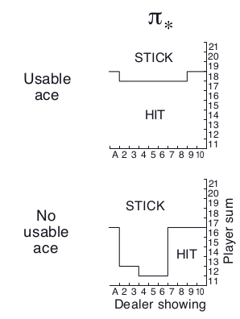

# BlackjackRL

Reinforcement learning is a very interesting machine learning paradigm which I wanted to learn. The simplest way to learn something is to try solving problems associated with the area that you are trying to master. Therefore, this project tries to implement well-known RL methods such as Monte Carlo ES (Exploring Starts), On-policy first-visit MC control (for epsilon-soft policies), Q-learning (off-policy TD control) and Sarsa (on-policy TD control) explained in the book "Reinforcement Learning: An Introduction" by Richard S. Sutton and Andrew G. Barto. Those methods are used in an environment of simplified game of blackjack.

## Game rules
- There is a player, a dealer and an infinite deck of cards(every card can be chosen with equal probability)
- All face cards count as 10, and ace can count as 1 or as 11
-  Player wants to get cards with the largest possible sum that doesn't exceed 21.
- Player plays only against the dealer
- The game begins with two cards dealt to both dealer and player.
- One of the dealer's cards is face up and the other is face down.
- If the player has 21 immediately (an ace and a 10-card), it is called a natural. He then wins unless the dealer also has a natural, in which case the game is a draw.
- The player can get additional cards, one by one(hit), stop(stick), exceed 21(goes bust)
- If he goes bust, he loses; if he sticks, then it becomes the dealer’s turn
- The dealer hits or sticks according to a fixed strategy without choice: he sticks on any sum of 17 or greater, and hits otherwise
- If the dealer goes bust, then the player wins; otherwise, the outcome—win, lose, or draw—is determined by whose final sum is closer to 21
- If the player holds an ace that he could count as 11 without going bust, then the ace is said to be usable.
## Best strategy
<p align="center">

</p>

## Running trainings

### Arguments:
| Argument &nbsp; &nbsp; &nbsp; &nbsp; | Description | Values |
| :---         |     :---      |          :--- |
| --agent         |     Agent's name      |  Choose from {monte_carlo_es,on_policy_first_visit_mc_control,q_learning,sarsa} |

### Example:
```bash
# Run Monte Carlo ES (Exploring Starts)
python main.py --agent=monte_carlo_es
```
